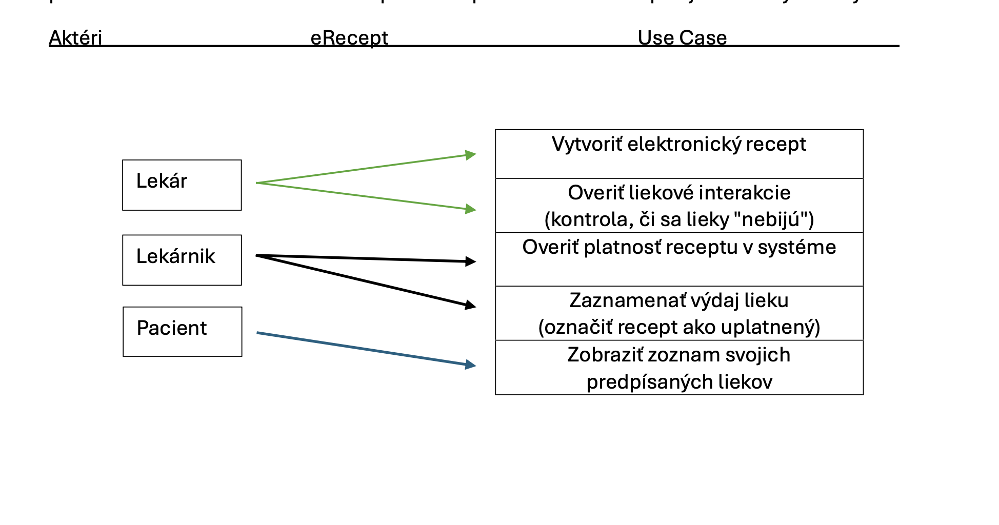
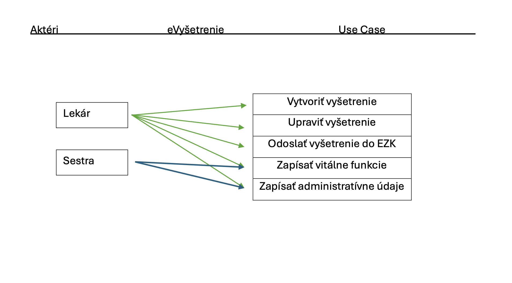
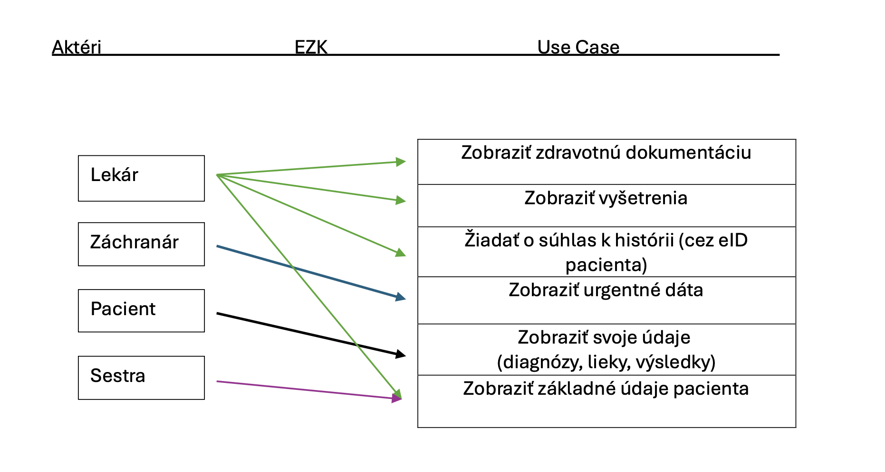
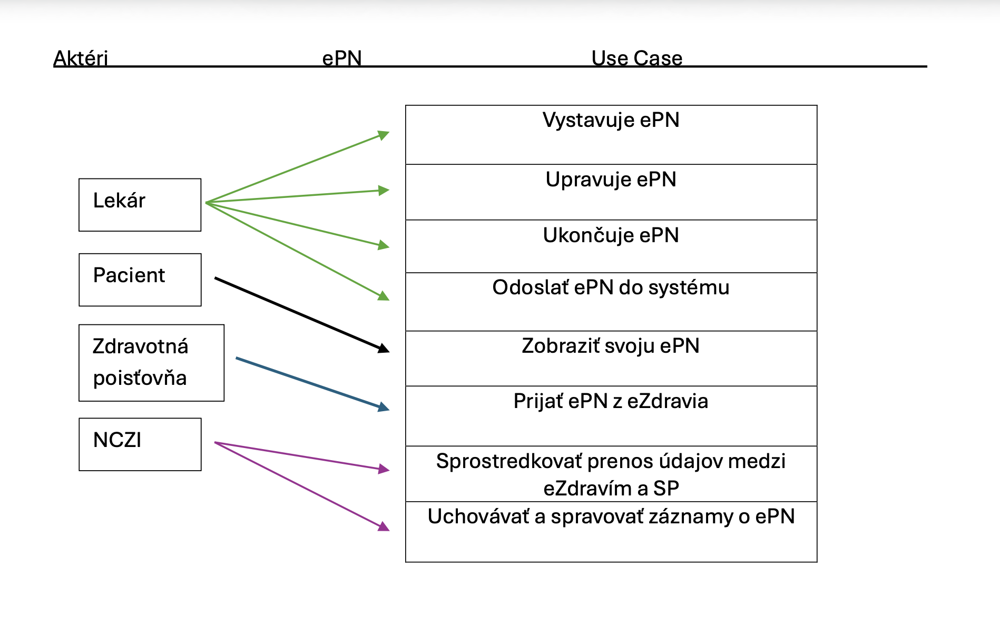
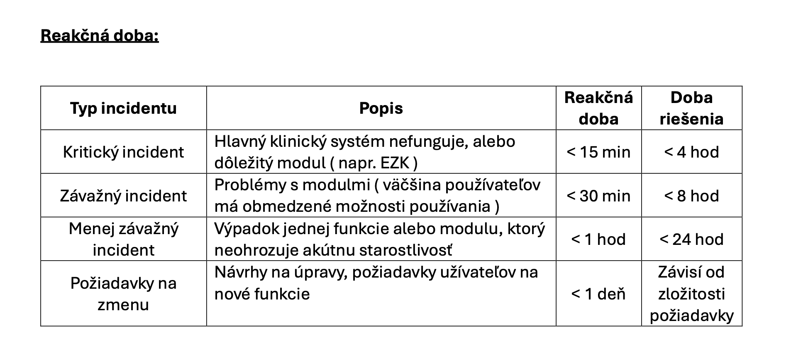

# Zhodnotenie informačného systému eZdravie

V tomto repozitári nájdete analytický pohľad na fungovanie štátneho systému elektronického zdravotníctva na Slovensku. Projekt sa venuje rozboru hlavných funkcionalít, definuje interakcie používateľov (prostredníctvom Use Case prístupu) a prináša modelový koncept zmluvy o úrovni služieb (SLA) pre zabezpečenie spoľahlivého chodu.

## Zameranie projektu
Digitalizácia zdravotníctva má za cieľ zefektívniť procesy, zabezpečiť bezpečnú výmenu dát a zlepšiť tak celkovú starostlivosť o pacientov. Táto analýza skúma reálny prínos platformy a definuje technické a prevádzkové parametre nevyhnutné pre jej stabilitu.

---

## Hlavné funkcionality a Use Case diagramy

Platforma slúži ako centrálny bod pre výmenu dát v zdravotníctve. Analyzované boli tieto kľúčové súčasti:

### 1. eRecept
Plnohodnotná náhrada papierových predpisov. Zabezpečuje predpisovanie medikamentov (vrátane automatizovanej kontroly interakcií), evidenciu vydania v lekárňach a pacientom poskytuje prehľad o ich liečbe.

### 2. eVyšetrenie
Umožňuje doktorom tvoriť elektronické správy z vyšetrení priamo v ambulanciách či nemocniciach.

### 3. Elektronická zdravotná knižka (EZK)
Hlavný prvok architektúry slúžiaci ako bezpečné dátové úložisko. Obsahuje históriu vyšetrení a záchranným zložkám (RZP/RLP) poskytuje včasný prístup ku kritickým informáciám (napr. alergie).

### 4. Centrálne registre
Databázy pod správou NCZI, ktoré uchovávajú a overujú kľúčové informácie o lekároch, zariadeniach a poistencoch.

### 5. ePN
Nástroj pre digitálne spravovanie práceneschopnosti, ktorý zefektívňuje výmenu informácií so Sociálnou poisťovňou.

---

## Technologické zázemie
Projekt využíva trojvrstvový architektonický model:
* **Prezentačná úroveň:** Rozhranie určené pre personál a pacientov.
* **Aplikačná úroveň:** Vnútorná logika a prepojenie jednotlivých subsystémov.
* **Dátová úroveň:** Bezpečné ukladanie informácií v štátom chránených dátových centrách.

---

## Návrh Service Level Agreement (SLA)
Súčasťou dokumentácie je modelový návrh zmluvy medzi NCZI a fiktívnym dodávateľom (Servis s.r.o.) pre zaistenie nepretržitého fungovania.

* **Cieľová dostupnosť:** 99,9 %
* **Odhadované mesačné výdavky:** 300 000 €

### Reakcia na výpadky
Vzhľadom na kritickosť prostredia sú definované striktné časové limity pre riešenie problémov:

### Penále za nedodržanie podmienok
Sankčný model zaisťuje motiváciu dodávateľa k stopercentnému výkonu. Maximálna výška pokút je ohraničená na 30 % z mesačného poplatku. Napríklad, ak dostupnosť klesne pod 98 %, pokuta predstavuje 15 %. Oneskorenie pri kritických chybách je penalizované sumou 3500 € za každú začatú hodinu.